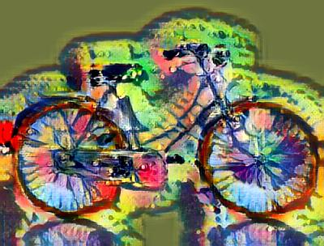
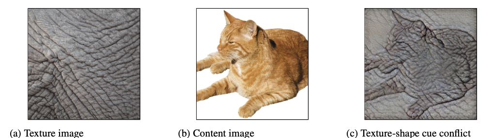
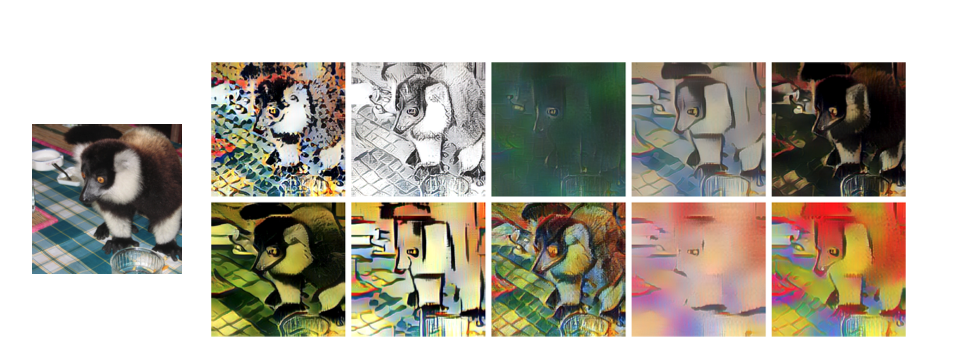
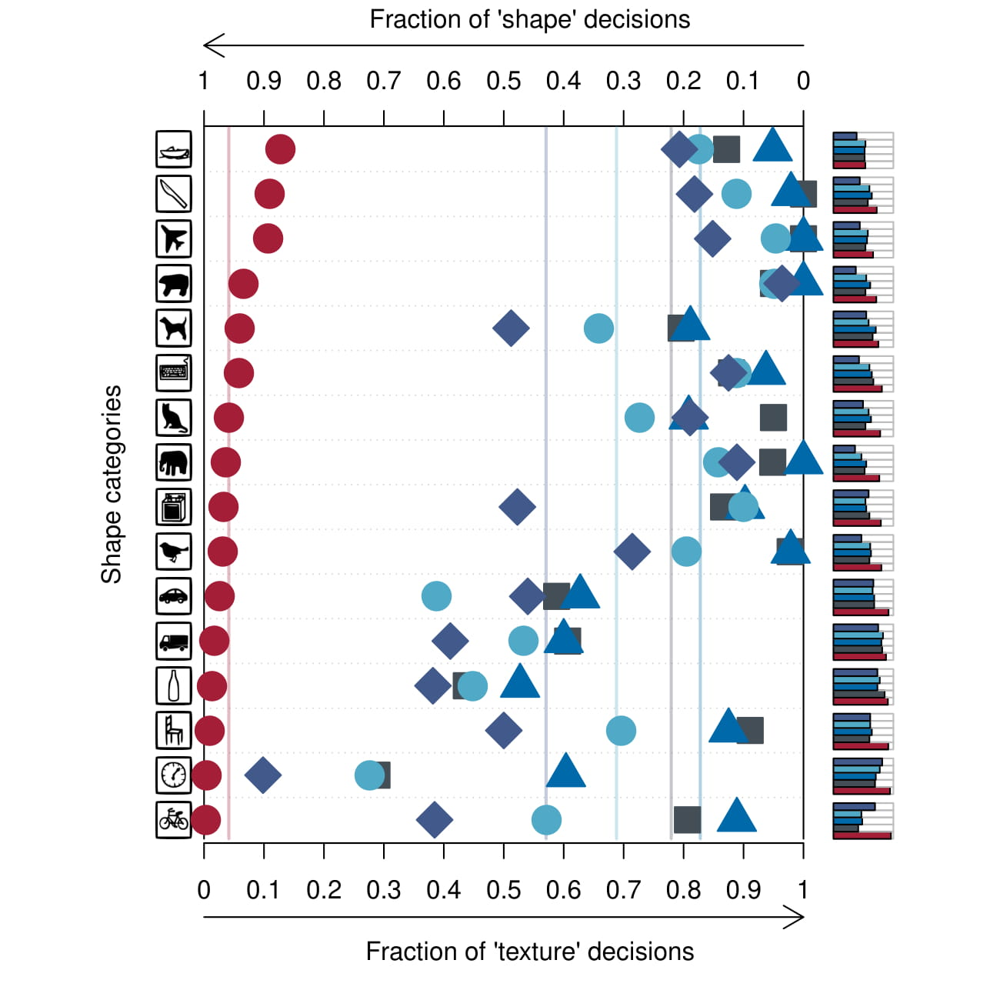
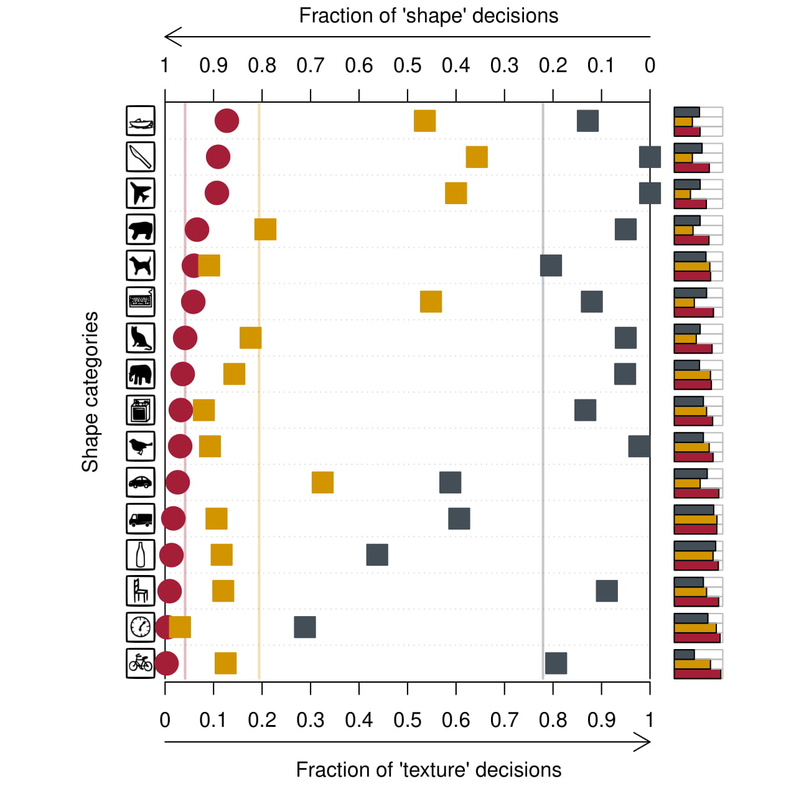
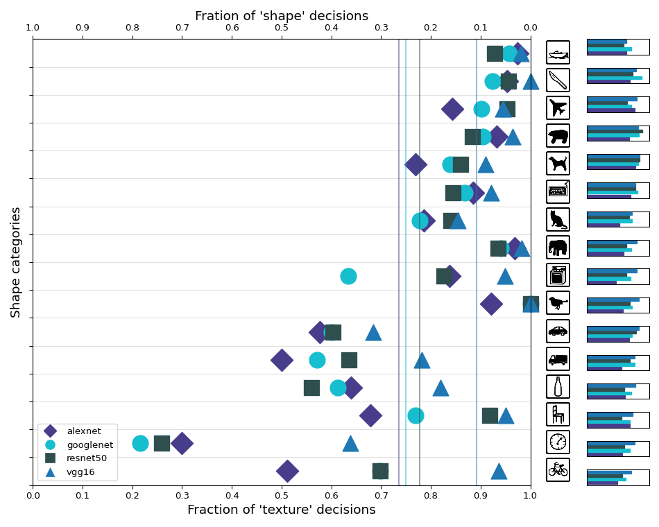
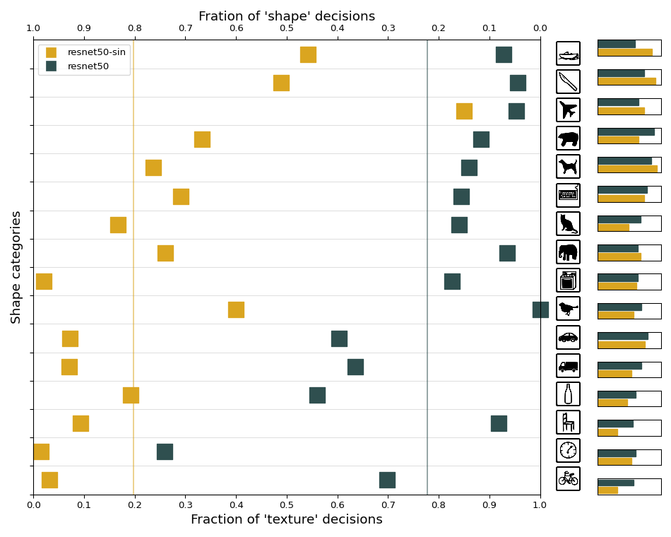

# CS4240 Reproducibility Project: ImageNet-trained CNNs are biased towards texture

 

## Authors

 - Just van Stam ([j.a.vanstam@student.tudelft.nl](j.a.vanstam@student.tudelft.nl))
 - Daniël van Gelder ([d.vangelder-1@student.tudelft.nl](d.vangelder-1@student.tudelft.nl))

## Introduction

The paper by Geirhos et al. \[1\] provides a novel perspective on the performance on ImageNet-trained CNNs. They argue that while it is commonly thought that Deep CNNs recognise objects by learning abstract representations of their shape, they rather learn to recognize objects by their texture(s). This is in contrast to how humans recognize objects, which is primarily by shape. 

Through a comparative study, the authors demonstrate that many state-of-the-art CNN models (e.g. ResNet, AlexNet, GoogLeNet, etc.) trained om ImageNet base their predictions on textures while humans base their respective predictions on shape. This result is achieved by performing a "style transfer" on some of the images in ImageNet. The style transfer is performed by extracting the texture of a _style_ image and applying that on a _content_ image. See the figure below for an example provided by the authors:

  
_Figure 1: Style transfer example where the leftmost image shows a picture of elephant skin used as the style image, the middle picture shows a picture of a cat used as the content image and the rightmost picture showing the style transfered result._

When a model predicts the class of the image as its texture's class rather than its content's class, this is called a "cue conflict".

After demonstrating that ImageNet trained CNNs are biased towards texture, the authors propose a solution to this phenomenon. A novel dataset is proposed built on top of ImageNet which applies style transfers to all images in ImageNet. This dataset is called "Stylized-Imagenet". 

Using the AdaIN style transfer approach by Huang and Belongie \[2\], images from ImageNet are converted to stylized images using random paintings (in this case, the [Kaggle Painter By Numbers Dataset](https://www.kaggle.com/c/painter-by-numbers/data)). The authors hypothesize that when models like ResNet-50 are trained on Stylized ImageNet, the frequency of cue conflicts is significantly reduced.

  
_Figure 2: Style transfer examples where the content image is the picture on the left and its corresponding stylized versions are the ten images to the right._

The results show that when ResNet-50 is trained on the Stylized-ImageNet the cue conflicts dramatically decrease. However, performance on the original ImageNet validation set is somewhat reduced. To combat this, the authors propose a model called Shape-ResNet which is trained on both ImageNet and Stylized-ImageNet and consequently fine-tuned on ImageNet again. This final model achieves a better score on the ImageNet task than the original ResNet-50 model.

## Paper Results 

The authors of the paper researched many state of the art CNN models. One of the focus points were ResNet-50, AlexNet, GoogLeNet and VGG-16. The authors used these models to predict 1280 images from 16 different ImageNet categories. All images contained a cue conflict from one of the other categories. Each of the models has a 1000 category output, so these outputs are mapped to the 16 remaining categories. In the image below, both the overall performance per category (right bar plots) and the fraction of shape decisions is established. The fraction of shape decisions is calculated by first finding all images with cue conflicts that are correctly classified. Meaning by correctly predicting either the shape or the texture of the image. The fraction of shape decisions is than the number of images correctly classified by shape divided by the total correctly classified images previously calculated:  
((correct shape decisions) / (correct shape decisions + correct texture decisions))

 

_Figure 3 (paper Figure 4): Classification results for human observers (red circles) and ImageNet-trained networks AlexNet (purple diamonds), VGG16 (blue triangles), GoogLeNet (turquoise circles) and ResNet-50 (grey squares)._

 
 

All models perform overall worse on the cue conflict validation set than on the normal ImageNet images. Most of the decisions are made on the texture of the image, and all the models perform poorly on the shape decisions. To investigate if it is possible to improve the shape decision fraction, the authors trained a ResNet-50 model on the Stylized-ImageNet dataset as previously described. 

 

_Figure 4 (paper Figure 5): Classification results for human observers (red circles) and results of resnet50 trained on the normal ImageNet (grey squares) vs resnet50 trained on Stylized-ImageNet (orange squares)_

## Replication
As the authors performed a lot of experiments, it was infeasible for us to replicate them all. We focussed on replicating Figure 3 and Figure 4. We ran the different models on the cue conflict validation set, like the authors did, to create the replicated figures below: 

 

_Figure 5: Our replication of Figure 4 in the paper. The legend describes which dots represent which model._

 

_Figure 6: Our replication of Figure 5 in the paper. The legend describes which dots represent which model._

We excluded the human trials on purpose, as it would suggest that we re-ran the human trial. Both replications show different results relative to their original. Figure 5 also shows different shape fraction averages compared with Figure 3, whereas Figure 6 has the same fraction averages as Figure 4. While there are differences between the original results and our results, the shape decision fractions per category do not differ a lot. For all four models in Figure 5 the same conclusions can be drawn, that the state-of-the-art models make most of the decisions based on the texture of the image. In our figure all models except resnet perform even poorer on the shape decision fraction than in the original results. The same goes for Figure 6, which shows that the ResNet-50 trained on the Stylized-ImageNet performs better in general and makes more decisions based on shape. 

| Model                           | Original | Reproduced |
|---------------------------------|----------|------------|
| AlexNet                         | 0.43     | 0.26       |
| GoogleNet                       | 0.31     | 0.25       |
| ResNet-50                       | 0.22     | 0.22       |
| VGG-16                          | 0.17     | 0.11       |
| ResNet-50 Stylized              | 0.81     | 0.81       |

_Table 1: Average Fraction of shape decisions between original paper and reproduction_

We do not completely understand why we are not generating the exact same results. As the authors did not supply the exact source code for generating the results, it is possible that they ran their test with slight alterations in the image preprocessing. In addition, they used some of the pre-defined models from the Caffe framework, while we used the predefined versions of PyTorch. It is possible that these models produce small inconsistencies. We do note, however, that the results still confirm the authors' findings. That is, that ImageNet-trained CNNs primarily base their object recognition decisions on textures rather than shape.

## Additional Dataset
<!-- Daniel -->
Besides replicating Figure 5 using the pre-trained weights provided by the authors, we wanted to replicate it by retraining the model on the Stylized-ImageNet dataset. However, due to the licensing of the ImageNet dataset, the authors were not allowed to share the dataset used. Therefore, we had to create it on our own. However, due to the sheer size of the ImageNet dataset and the limited hardware available for the style transfers, we opted to recreate a downsampled version of Stylized-ImageNet with a resolution of 64x64. 

Creating this dataset was non-trivial as it requires sophisticated compute hardware. We initially attempted to run this on a Google Cloud VM could not create an instance with a sophisticated enough GPU within budget to create the dataset in a reasonable amount of time. Thus, we tried to create the dataset in Colab Notebooks using Colab Pro. This turned out to be possible. We created the dataset in 10 batches taking approximately ~3.5 hours per batch. 

Then we tried to train ResNet-50 to this dataset. However, we went over budget in setting up a VM to train the model on the dataset. Therefore, we leave training the model to this downsampled dataset as future work. Our contribution will therefore be limited to the additional dataset. It should be interesting to evaluate if a ResNet-50 model trained on the downsampled stylized dataset will be as effective as when it is trained on the original stylized dataset. It may be that shapes are not as apparant in this downsampled version.

## Conclusion
<!-- Daniel -->
<!-- Future work -->
With this reproduction we have replicated a portion of the results in the paper by Geirhos et al. Our work indicates that ImageNet trained CNNs are indeed biased towards iamge texture and thus confirm the authors' findings. As future work, we propose that, using the downsampled dataset that was created with this project, the ResNet-50 model is re-trained using that dataset to further confirm the results put forward by the authors. 

## References
- \[1\]: Geirhos, R., Rubisch, P., Michaelis, C., Bethge, M., Wichmann, F. A., & Brendel, W. (2018). ImageNet-trained CNNs are biased towards texture; increasing shape bias improves accuracy and robustness. _arXiv preprint arXiv:1811.12231_

- \[2\]: Huang, X., & Belongie, S. (2017). Arbitrary style transfer in real-time with adaptive instance normalization. In _Proceedings of the IEEE International Conference on Computer Vision_ (pp. 1501-1510).
Chicago	

# Using this Repository

## Replicating the figures
In order to create the data to create the figures from this report, run the script `code/evaluate_models.pipeline.py` with the following arguments:

1. model name
2. stimuli directory (in our case: `stimuli/style-transfer-preprocessed-512`) 
3. output csv file name
4. if using stylized pretrained models, add `-s`

Create the figures in the notebook `code/ReproduceFigures.ipynb`

## Creating the stylized dataset

The raw data used for the figures we re-created can be found in the `code/fig4results` and `code/fig5results`.

The code to create the stylized dataset can be found in the repository by the original authors: 

https://github.com/bethgelab/stylize-datasets
